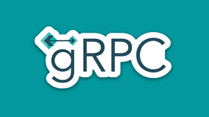
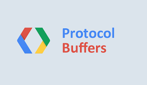

<h1 align="center">Hi 👋, I'm Anuj</h1>
<h3 align="center">Full Stack Developer with 4+ years of experience</h3>

## 🌐 Socials

## 💻 Tech Stack

    
    
    
    
    

    
    
    
    
    
    
    

    
    
    
    
    
    
    
    
    
    

## 📊 GitHub Stats :
 
 

## 🏆 GitHub Trophies

